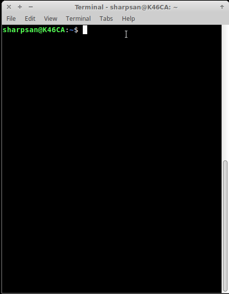

# Cipher-Java

### Example
This shows a cipher test by running the jar file in a terminal.

### Download
[Download](https://github.com/sharpsan/Cipher-Java/blob/master/out/artifacts/BasicCipher_jar/BasicCipher.jar?raw=true) the latest jar executable

### Running .jar from terminal
1. Open terminal and `cd` to whatever directory the jar is stored
2. Type: `java -jar BasicCipher.jar` to run